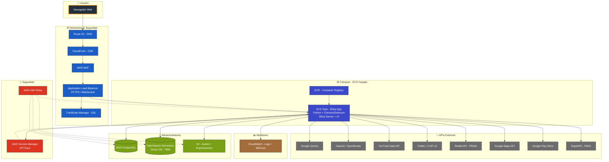

```mermaid
graph TB
    subgraph Usuario["👤 Usuario"]
        Browser[Navegador Web]
    end

    subgraph Networking["🌐 Networking & Seguridad"]
        R53[Route 53 - DNS]
        CF[CloudFront - CDN]
        WAF[AWS WAF]
        ALB[Application Load Balancer<br/>HTTPS / WebSocket]
        ACM[Certificate Manager - SSL]
    end

    subgraph Compute["⚙️ Cómputo - ECS Fargate"]
        direction TB
        ECR[ECR - Container Registry]
        ECS_TASK[ECS Task - Shiny App<br/>Python + Chrome/Selenium<br/>Shiny Server + UI]
    end

    subgraph Storage["💾 Almacenamiento"]
        RDS[(RDS PostgreSQL)]
        OS[(OpenSearch Serverless<br/>Vector DB - 768d)]
        S3[S3 - Assets + Exportaciones]
    end

    subgraph Security["🔐 Seguridad"]
        SM[AWS Secrets Manager<br/>API Keys]
        IAM[AWS IAM Roles]
    end

    subgraph Monitoring["📊 Monitoreo"]
        CW[CloudWatch - Logs + Métricas]
    end

    subgraph ExternalAPIs["🔗 APIs Externas"]
        LLM1[Google Gemini]
        LLM2[OpenAI / OpenRouter]
        API1[YouTube Data API]
        API2[Twitter / X API v2]
        API3[Reddit API - PRAW]
        API4[Google Maps API]
        API5[Google Play Store]
        API6[RapidAPI - FB/IG]
    end

    %% Conexiones
    Browser --> R53
    R53 --> CF
    CF --> WAF
    WAF --> ALB
    ALB --> ACM
    ALB --> ECS_TASK

    ECR --> ECS_TASK

    ECS_TASK --> RDS
    ECS_TASK --> OS
    ECS_TASK --> S3
    ECS_TASK --> SM
    ECS_TASK --> CW

    ECS_TASK --> LLM1
    ECS_TASK --> LLM2
    ECS_TASK --> API1
    ECS_TASK --> API2
    ECS_TASK --> API3
    ECS_TASK --> API4
    ECS_TASK --> API5
    ECS_TASK --> API6

    SM -.-> ECS_TASK
    IAM -.-> ECS_TASK
    IAM -.-> RDS
    IAM -.-> S3
    IAM -.-> OS

    %% Estilo
    classDef aws fill:#FF9900,color:#232F3E,stroke:#232F3E,stroke-width:2px
    classDef compute fill:#3B48CC,color:#fff,stroke:#232F3E
    classDef storage fill:#7AA116,color:#fff,stroke:#232F3E
    classDef security fill:#DD3522,color:#fff,stroke:#232F3E
    classDef network fill:#1B5EC8,color:#fff,stroke:#232F3E
    classDef external fill:#6C6C6C,color:#fff,stroke:#333,stroke-dasharray: 5 5
    classDef monitor fill:#A36C3B,color:#fff,stroke:#232F3E
    classDef user fill:#232F3E,color:#fff,stroke:#FF9900,stroke-width:3px

    class R53,CF,WAF,ALB,ACM network
    class ECR,ECS_TASK compute
    class RDS,OS,S3 storage
    class SM,IAM security
    class CW monitor
    class LLM1,LLM2,API1,API2,API3,API4,API5,API6 external
    class Browser user
```
