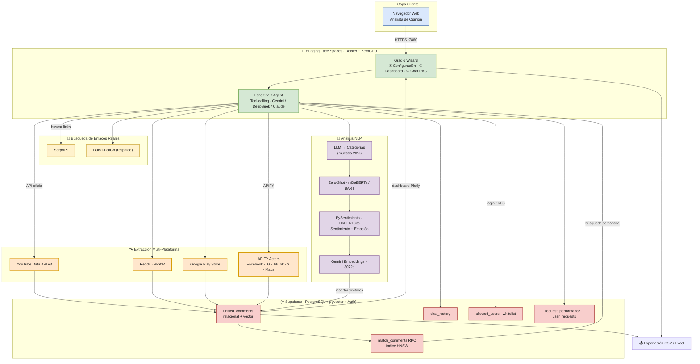
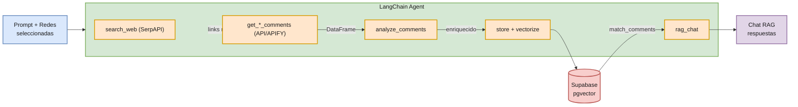

# ChismesitoGPT v2 — Diagramas de Arquitectura

> **Actualizado a la versión nueva (`chismesito_gpt_nueva_version`).**
> La versión anterior (Shiny + Selenium/ChromeDriver + Pinecone, desplegada en AWS) es **obsoleta**.
> Esta guía documenta la arquitectura actual: **Gradio + LangChain Agent + APIFY + Supabase (pgvector)**, desplegada en **Hugging Face Spaces**.

---

## Arquitectura General del Sistema



---

## Flujo del Agente y Pipeline de Análisis



---

## Opción 1: CLI de nanobanana

```bash
nanobanana architecture "Cloud architecture for ChismesitoGPT v2, an AI social-listening platform. The system is deployed on Hugging Face Spaces as a Docker container with ZeroGPU. A Gradio Wizard UI (3 steps: Configuration, Dashboard, RAG Chat) runs a LangChain tool-calling agent that orchestrates LLMs (Gemini, DeepSeek, Claude). The agent uses SerpAPI and DuckDuckGo to find real social-media links, then extracts comments via official APIs (YouTube Data API v3, Reddit PRAW, Google Play Store) and APIFY actors (Facebook, Instagram, TikTok, X/Twitter, Google Maps). An NLP pipeline classifies topics (LLM zero-shot), sentiment and emotion (PySentimiento / RoBERTuito), and generates 3072-d Gemini embeddings. All data lands in Supabase PostgreSQL with pgvector (HNSW index, match_comments RPC), Supabase Auth + whitelist, and audit tables. Plotly dashboards and CSV/Excel exports complete the flow. Show data flows and color-code by layer: client, app, search, extraction, NLP, storage. The RAG works with DeepSeek or Gemini or ChatGPT or Claude and in the future will work with Mistral or GLM"
```

## Opción 2: Diagrama técnico detallado con /diagram

```
/diagram Architecture for ChismesitoGPT v2 social-media analytics app deployed on Hugging Face Spaces (Docker + ZeroGPU): Gradio Wizard UI (Config, Dashboard, RAG Chat) -> LangChain tool-calling Agent (Gemini/DeepSeek/Claude) -> SerpAPI/DuckDuckGo search -> official APIs (YouTube, Reddit, Play Store) and APIFY (FB, IG, TikTok, X, Maps). NLP pipeline: LLM categories + zero-shot + PySentimiento + Gemini 3072-d embeddings -> Supabase PostgreSQL + pgvector (HNSW, match_comments RPC, Auth whitelist, audit logs). Plotly dashboards, CSV/Excel export. --type=architecture --complexity=comprehensive --style=technical
```

## Opción 3: Prompt para MCP Nano Banana

```
Generate a clean, professional cloud architecture diagram for ChismesitoGPT v2, an AI social-listening and opinion-mining platform.

The application runs on Hugging Face Spaces as a Docker container with ZeroGPU acceleration. A Gradio Wizard UI (3 steps: Configuration, Dashboard, RAG Chat) drives a LangChain tool-calling agent that orchestrates multiple LLMs (Google Gemini, DeepSeek, Claude).

Architecture components:
1. Client: Web browser (analyst) accessing the Gradio UI over HTTPS on port 7860.
2. App layer (Hugging Face Spaces): Gradio Wizard + LangChain Agent.
3. Link search: SerpAPI (primary) and DuckDuckGo (fallback) to discover real social-media URLs.
4. Extraction: Official APIs — YouTube Data API v3, Reddit (PRAW), Google Play Store; and APIFY actors for Facebook, Instagram, TikTok, X/Twitter, and Google Maps.
5. NLP / analysis: LLM-generated topic categories (from a 20% sample), zero-shot classifier (mDeBERTa / BART), sentiment & emotion via PySentimiento (RoBERTuito), and 3072-d Gemini embeddings.
6. Storage: Supabase PostgreSQL with pgvector — unified_comments (relational + vector), chat_history, allowed_users (whitelist), match_comments RPC with HNSW index, and audit tables (request_performance, user_requests). Supabase Auth handles login and Row Level Security.
7. Output: Plotly dashboards and CSV/Excel export.
8. RAG works with DeepSeek or Gemini or ChatGPT or Claude and in the future will work with Mistral or GLM

Style: Corporate, modern diagram in the visual language of "Daily Dose of Data Science" — flat rounded nodes, soft pastel color palette grouping components by layer (client = light blue, app = light green, search = light yellow, extraction = light orange, NLP = light purple, storage = light red/pink), thin consistent strokes, clear labeled arrows showing data-flow direction. No 3D, no heavy gradients.
```
